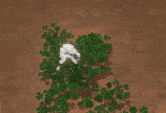

## Demo video:
Engine top down shooter demo video:

https://www.youtube.com/watch?v=FHfV1GQ4_JA

Compute shader demo video:
https://www.youtube.com/watch?v=B6pjqZyI28w

## How to build
The easies way to build is to use Visual Studio (open cmake)  
Requires Vulkan SDK

## How to run demo projects:
Follow these steps:  
- Make sure all the executables are built (ProjectManager.exe in particular)
- Add the following line to the `vulkan-engine\bin\create_symlink.bat`:  
```mklink /D %~dp0\assets %~dp0\..\assets\assets.cache```  
This step is optional but must be done to avoid running ProjectManager.exe as administrator.
- Execute the batch file ```vulkan-engine\bin\create_symlink.bat```. It should create two symlinks in the ```vulkan-engine\bin``` folder: shaders and assets. Asset may not work yet, it's fine.
- Run ProjectManager project. If you skipped the editing of .bat file the ProjectManager must be run as an administrator in order to create the symlink.
- In the ProjectManager select `Project -> Open` and select ```vulkan-engine\assets\assets```
- Select `Assets -> Export` pending assets to trigger the asset build.

It should produce ```vulkan-engine\assets\assets.cache``` folder with engine-readable assets in it.

Check the assets symlink - it should be pointing to ```vulkan-engine\assets\assets.cache``` folder.  
And the shaders symlink must be pointing to ```vulkan-engine\engine\shaders```.

Now demo projects should run without errors

## Engine roadmap:

#### High priority
- [ ] Attractors for GPU Particle demo
- [ ] Add GPU particles to the Top Down Shooter demo
- [ ] Instancing
- [ ] GPU Culling
- [ ] Bindless textures

#### Backlog
- [ ] Proper deletion of entities loaded from resource
- [ ] export default materials from fbx (with texture paths)
- [ ] physics rendering interpolation
- [ ] Fix logging, log from multiple threads
- [ ] Fix and migrate lighting, decals, shadowmaps to ECS
- [ ] Handles for all engine resources
- [ ] Use pipelines directly
- [ ] Shader reloading
- [ ] Multithreaded rendering
- [ ] GUI library integration
- [ ] Finalize top down shooter demo

#### Completed
- [x] Basic Top Down Shooter demo
- [x] bloom
- [x] Refactored resource and constants binding
- [x] bone attachments
- [x] fix deadlock: resource loading exception during main thread resolve()
- [x] properly handle missing textures
- [x] properly export animations in fbx exporter
- [x] asset database and UI
- [x] export textures
- [x] DDS loading
- [x] optimize tiled lighting or implement clustered
- [x] Image based lighting support
- [x] additional parameters for resource handles (e.g. texture srgb)
- [x] HLSL includes must be included in hash
- [x] FBX mesh export
- [x] fix normal mapping
- [x] New skinning animation system
- [x] Proper alignment of ECS components
- [x] Action puzzle demo
- [x] Add support for singleton components (store in EntityManager by pointer)
- [x] Material resource
- [x] Multithreading, job system
- [x] Async resource loading
- [x] Fix release build settings in cmake
- [x] lambda API for ECS
- [x] PhysX integration 
- [x] Rendering of MultiMesh
- [x] Extract assets into a private repo
- [x] FBX physics mesh export
- [x] GameObject file format
